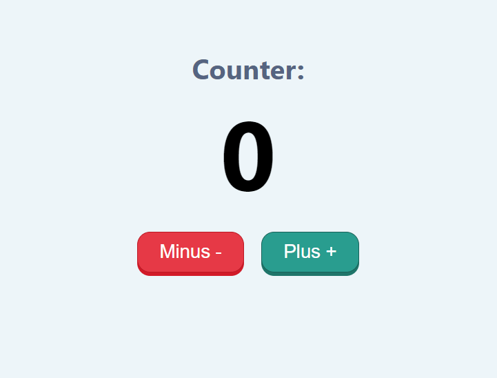
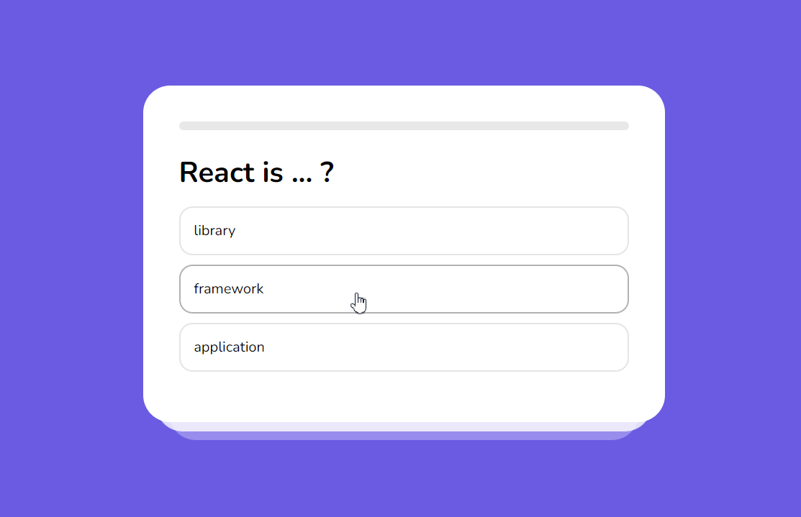
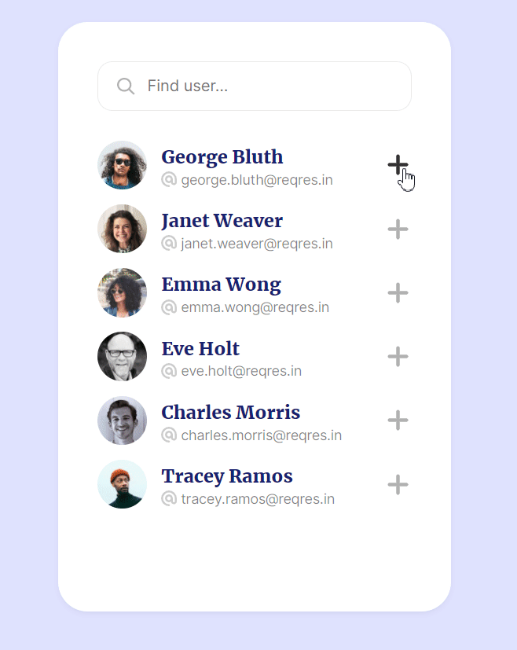

 

<h2 align="center">React Projects</h2>

  

    <a href="https://github.com/Freekson/react-projects/issues">Report Bug</a>

  

<!-- TABLE OF CONTENTS -->

  
Table of Contents

  <ol>   
    <li><a href="#counter">Counter</a></li>
    <li><a href="#modal">Modal</a></li>
    <li><a href="#quiz">Quiz</a></li>
    <li><a href="#list-of-users">List of users</a></li>
  </ol>

# Counter

# Modal

# Quiz

# List of users

# Contact

Yehor Dreval

- [instagram](https://www.instagram.com/freeksons)
- [telegram](https://t.me/freekson)

Project Link: [React projects](https://github.com/Freekson/react-projects)

(<a href="#top">back to top</a>)

